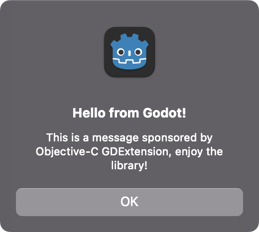

# ObjC GDExtension
Experimental GDExtension for calling Object-C methods at runtime in Godot 4.1+

**Warning**: passing the wrong data types to methods may crash the Godot editor and built projects.
Use at your own risk.


## Features
- All calls are made using the Objective-C runtime, so that all classes and methods are available
- Supports macOS and iOS builds, as well as the Godot editor running on macOS
- Uses [Key-Value Coding](https://developer.apple.com/documentation/objectivec/nsobject/nskeyvaluecoding) for getting and setting properties


## How to use
```gdscript
extends RefCounted


func _ready():
    if OS.get_name() != "macOS":
        print("Sorry, NSAlert is available in macOS only")
        return

    # 1. Get the Objective-C class by name
    var NSAlert = ObjCClass.from_string("NSAlert")

    # 2. Alloc and init objects
    var alert = NSAlert.alloc("init")
    
    # 3. Get and set values normally
    #    Note that property names must match Objective-C ones
    alert.messageText = "Hello from Godot!"
    alert.informativeText = "This is a message sponsored by Objective-C GDExtension, enjoy the library!"

    # 4. Send messages
    alert.perform_selector("runModal")
```

